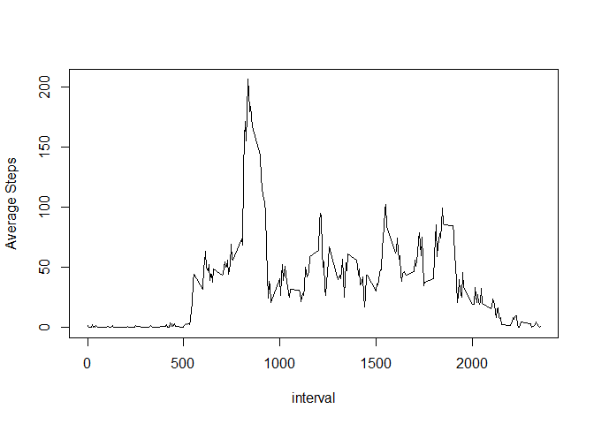
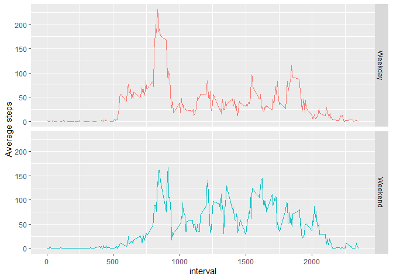

## Reading in the dataset


```r
activity <- read.csv("activity.csv", header=TRUE)
```
  
## Histogram of the total number of steps taken each day

```r
total <- activity %>%
         group_by(date) %>%
         summarize(total=sum(steps, na.rm=TRUE))
hist(total$total, breaks = 10, xlab="", main="Histogram of the total number of steps")
```

<!-- -->
  
## Mean and median number of steps taken each day

```r
print(paste("Mean =", mean(total$total)))
```

```
## [1] "Mean = 9354.22950819672"
```

```r
print(paste("Median =", median(total$total)))
```

```
## [1] "Median = 10395"
```
  
## Time series plot of the average number of steps taken

```r
aver_5min <- activity %>%
             group_by(interval) %>%
             summarize(aver=mean(steps, na.rm=TRUE))
plot(aver_5min$interval, aver_5min$aver, type="l", xlab="interval", ylab="Average Steps")
```

<!-- -->
  
## The 5-minute interval that, on average, contains the maximum number of steps

```r
aver_5min[which.max(aver_5min$aver),]
```

```
## # A tibble: 1 x 2
##   interval  aver
##      <int> <dbl>
## 1      835  206.
```

## Imputing the missing data

- calculate the total number of missing data

```r
sum(is.na(activity$steps))
```

```
## [1] 2304
```
  

- check out the distribution of the missing data

```r
table(as.character(activity[is.na(activity$steps), "date"]))
```

```
## 
## 2012-10-01 2012-10-08 2012-11-01 2012-11-04 2012-11-09 2012-11-10 2012-11-14 
##        288        288        288        288        288        288        288 
## 2012-11-30 
##        288
```
  
- treat the missing data  
The data were missing by "days", i.e., the total data in a particular day were completely recorded or completely missing. There is no absolute pattern for those missing dates, so the missing data will be filled with the average values of the same interval.

```r
activity_imputed <- merge(activity, aver_5min, by="interval")
missing <- is.na(activity_imputed$steps)
activity_imputed[missing, "steps"] = activity_imputed[missing, "aver"]
```
  
## Histogram of the total number of steps taken each day after missing values are imputed

```r
total <- activity_imputed %>%
         group_by(date) %>%
         summarize(total=sum(steps))
hist(total$total, breaks=10, xlab="", main="Histogram of the total number of steps")
```

<!-- -->
  
## Panel plot comparing the average number of steps taken per 5-minute interval across weekdays and weekends

```r
aver_5min_wd <- activity_imputed %>%
                mutate(wkday = wday(as.Date(date), label=TRUE)) %>%
                mutate(wkend = ifelse(wkday %in% c("Sat", "Sun"), "Weekend", "Weekday")) %>%
                group_by(wkend, interval) %>%
                summarize(aver=mean(steps))

g <- ggplot(aver_5min_wd, aes(interval, aver, col=wkend))
g + geom_line() + facet_grid(wkend~.) + 
    labs(y="Average steps") + theme(legend.position="none")
```

<!-- -->
  
  


